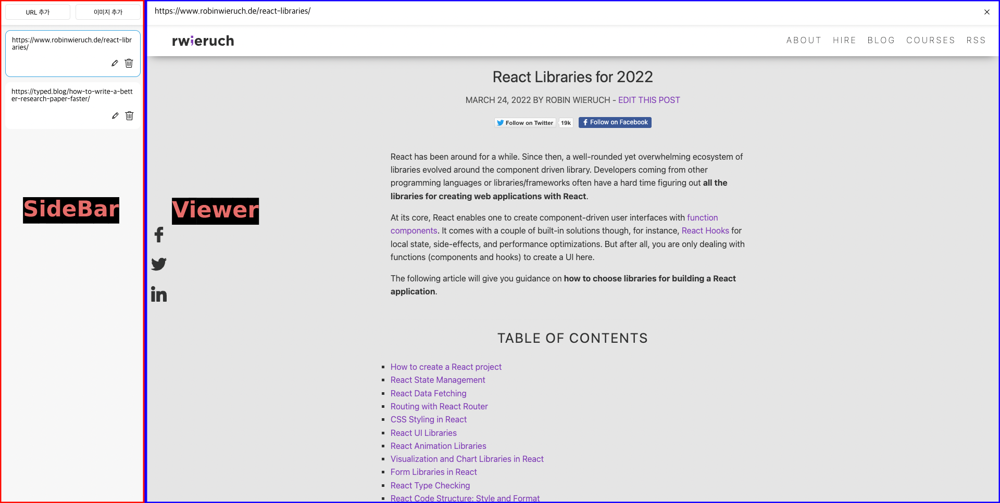
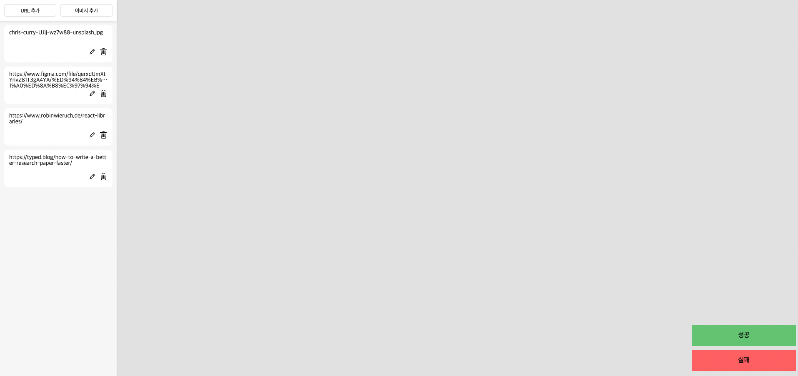
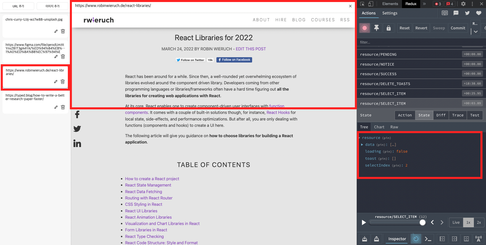
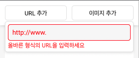

# Resource 관리 웹 어플리케이션

https://ranjafunc.github.io/typed_resource_list

## Stacks

    React Typescript Styled-components Redux-saga typed-design-system uuid

- Redux-Saga

  리소스 관리 기능들이 비동기적인 처리과정이 필요하고 View에서 로직을 분리해 체계적으로 관리하기 위해 사용하였습니다.

- uuid

  리소스별로 겹치지 않는 id를 주기 위해 사용하였습니다.

<br />

# 구현과정

## 1. 레이아웃 구성 및 State 설계



<strong style='font-size:16px;'>레이아웃 구성</strong>

- Resource의 생성, 수정, 삭제를 담당할 SideBar 컴포넌트
- Resource를 읽고 사용자에게 보여줄 Viewer 컴포넌트

<br/>

```ts
const initialState: ResourceState = {
	data: [
		name: '리액트 관련 문서',
        data: 'https://www.robinwieruch.de/react-libraries/'
	],
	loading: false,
	toast: [],
	selectIndex: null,
};
```

<strong style='font-size:16px;'>Redux Resource 구조</strong>

- data: 한개의 리소스에는 제목과 해당 데이터를 가진 객체 구조로 구성
- toast: 리소스 등록과정 중 생기는 성공,실패 여부를 저장할 배열
- selectIndex: 특정 리소스를 읽어올 때 선택된 리소스의 인덱스를 저장할 변수

<br />
<hr/>
<br />

## 2. 리소스 추가 기능

리소스 유형 - string(링크) / image(파일)

- 링크형 리소스 http/http 스키마 확인 필요

  - 정규표현식으로 올바른 도메인주소인지 확인하고 dispatch를 시작하게 작성하였습니다.

  ```tsx
  const pattern =
  	/^(((http(s?))\:\/\/)?)([0-9a-zA-Z\-]+\.)+[a-zA-Z]{2,6}(\:[0-9]+)?(\/\S*)?/;
  const regex = new RegExp(pattern);

  const onSubmit = (e: React.FormEvent<HTMLFormElement>) => {
  	e.preventDefault();
  	const { value } = e.currentTarget.children[0] as HTMLInputElement;

  	if (regex.test(value)) {
  		setIsOpen(false);
  		dispatch(addLinkSagaStart(value));
  		setError(false);
  	} else {
  		setError(true);
  	}
  };
  ```

- 링크형 리소스에서 youtube url은 아이프레임에 반영할 수 있는 embed url로 변경

  ```ts
  // redux-saga에서 data배열에 저장하기 전 url변환
  if (payload.includes("www.youtube.com")) {
  	const params = new URL(payload).searchParams;
  	let v = params.get("v");
  	payload = `https://www.youtube.com/embed/${v}`;
  }
  ```

- `리소스 등록 validation`

  1.  랜덤 딜레이 및 성공 확률 로직은 유틸 함수로 분리햇습니다.

      ```ts
      const getRandomTime = () => {
      	return Math.floor(Math.random() * 700 + 300);
      };

      const getRandomDelay = () => {
      	const time = getRandomTime();
      	setTimeout(() => console.log(`${time} delay`), time);
      };

      const getRandom = () => {
      	return Math.random() <= 0.8;
      };

      export { getRandomDelay, getRandom };
      ```

  2.  saga에서 새로운 리소스를 추가할 때마다 해당 로직 함수를 실행하여 분기처리했습니다.

      ```ts
      function* addLinkSaga(action: Action<string>) {
      	try {
      		yield put(pending());
      		yield call(getRandomDelay);
      		const isValidate = getRandom();
      		if (!isValidate) throw new Error("실패");

      		const { payload } = action;
      		const data = { name: payload, data: payload };
      		yield put(success([data]));
      	} catch (err) {
      		yield put(fail(["실패"]));
      	}
      }
      ```

  3.  등록 시 성공 및 실패 여부를 toast 변수에 저장해서 관리하고 시간이 지나면 사라지게 처리하였습니다.

      

      ```ts
      // redux/modules/resource
      const reducer = handleActions<ResourceState, any>(
      	{
      		...,
      		NOTICE: (state, action) => {
      				return {
      					...state,
      					toast: state.toast.concat(action.payload),
      				};
      			},
      		...
      	},
      	initialState,
      	{ prefix }
      );
      ```

          ```ts
          // components/toast
          const Toast = () => {
          	const dispatch = useDispatch();
          	const toast = useSelector<RootState, string[]>(
          		(state) => state.resource.toast
          	);

          	useEffect(() => {
          		if (toast.length > 0) {
          			setTimeout(() => {
          				dispatch(deleteToasts());
          			}, 3000);
          		}
          	}, [toast]);

          	return (
          		<Container>
          			{toast.map((message, i) => {
          				return <ToastItem isSuccess={message !== "실패"}>{message}</ToastItem>;
          			})}
          		</Container>
          	);
          };
          ```

  4.  이미지 파일 리소스 다중 등록 시 개별로 검증 과정이 필요하여 Promise.all을 활용하여 처리하였습니다.

      ```ts
      function getValidation(datas: File[]) {
      	return Promise.all(
      		datas.map(async (v: File) => {
      			const isValidate = await getRandom();
      			// 검증 실패 시 데이터 대신 false 반환
      			return isValidate && { name: v.name, data: v };
      		})
      	);
      }

      function* addImgSaga(action: Action<File[]>) {
      	try {
      		yield put(pending());
      		const datas: (ResourceObjType | false)[] = yield call(() =>
      			getValidation(action.payload)
      		);

      		yield put(
      			notice(
      				datas.map((v) => {
      					return v ? "성공" : "실패";
      				})
      			)
      		);
      		yield put(success(datas.filter((v) => v !== false)));
      	} catch (err) {
      		console.log(err);
      	}
      }
      ```

<br />
<hr />
<br />

## 3. 리소스 목록 조회, 삭제, 수정 기능

- 리덕스 resource의 data 배열 렌더링 처리로 목록 조회 기능 구현하엿습니다.

  ```ts
  import React from "react";
  import { ResourceObjType } from "../../types";
  import ListItem from "../ListItem";
  import { Container } from "./style";

  interface ListProps {
  	list: ResourceObjType[];
  }

  const List = ({ list }: ListProps) => {
  	return (
  		<Container>
  			{list.map((value) => (
  				<ListItem value={value} />
  			))}
  		</Container>
  	);
  };

  export default List;
  ```

- ListItem 컴포넌트에 리소스 삭제, 편집, 선택 등 관심사를 집중시켜 작성햇습니다.

  ```ts
  import React from "react";
  import { ResourceObjType } from "../../types";
  import { TypedIcon } from "typed-design-system";
  import useListItem from "./hooks/useListItem";

  import {
  	Container,
  	ItemTitle,
  	ItemTools,
  	ItemButton,
  	ItemEditTitle,
  } from "./style";

  interface ListItemProps {
  	value: ResourceObjType;
  }

  const ListItem = ({ value }: ListItemProps) => {
  	const {
  		isEdit,
  		text,
  		onChange,
  		handleSelect, // 클릭 시 해당 props의 데이터와 redux의 data 배열의 객체와 비교하여 index 저장
  		handleEdit, // isEdit 상태변수 활용하여 클릭했을 때 true였으면 현재 element 텍스트로 기존 데이터 업데이트
  		handleDelete, // 클릭 시 redux의 data 배열에서 해당 객체 삭제 처리
  		checkSelected,
  	} = useListItem(value);

  	return (
  		<Container onClick={handleSelect} isSelect={checkSelected()}>
  			<ItemTitle isEdit={isEdit}>{text}</ItemTitle>
  			<ItemEditTitle isEdit={isEdit} value={text} onChange={onChange} />

  			<ItemTools>
  				<ItemButton onClick={handleEdit}>
  					<TypedIcon icon='edit_small' color='black' />
  				</ItemButton>
  				<ItemButton delete onClick={handleDelete}>
  					<TypedIcon icon='trash_small' color='black' />
  				</ItemButton>
  			</ItemTools>
  		</Container>
  	);
  };

  export default ListItem;
  ```

<br />
<hr/>
<br />

## 3. 선택된 리소스 Viewer컴포넌트의 Iframe에서 렌더링



- <U style="text-decoration: line-through;">Sidebar의 리소스 아이템을 클릭할 시 해당 index를 selectIndex로 저장</U>
- Sidebar의 리소스 아이템을 클릭할 시 해당 id를 selectIndex로 저장
- Viewer에서는 selectIndex의 값이 존재할 때만 아이프레임을 보여주도록 분기처리하엿습니다.

<br/>

<br/>

# UX 개선사항 및 추가 기능

## 1. 링크형 리소스 등록 시 올바르지 않은 도메인 주소일때 컬러 처리


